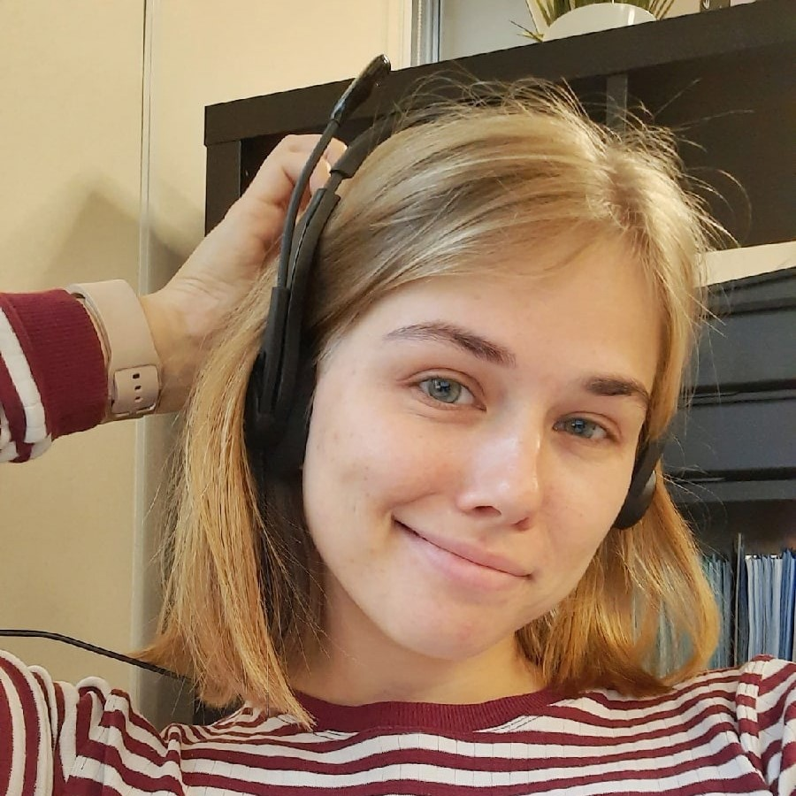

# Olga Bachaldina


## Contacts
**Email:** olbadrab@gmail.com

**GitHub:** [my profile](https://github.com/OlgaBachaldina)

**Discord (rs-school server):** *Olga Bachaldina (@OlgaB)*

## Brief summary
I'm studying to be a communications network engineer. My purpose is to become a web application developer. I am able to multitask. My favourite part of working is to help people find their real problems and solve it. I wanna make life more splendid.

## Skills
+ programming languages: Assembler, PascalABC, JavaScript
+ version control: GitHub

## Code
```
function nthFibo(n) {
    let arr=[0,1];
    for (let i=2;i<=n;i++){
        arr.push(arr[i-2]+arr[i-1]);
    }
    return arr[n-1];
}
```
## Projects
+ [rsschool-cv](https://github.com/OlgaBachaldina/rsschool-cv)

## Education
The Bonch-Bruevich Saint Petersburg State University of Telecommunications

## English
A2 (Pre-Intermediate)